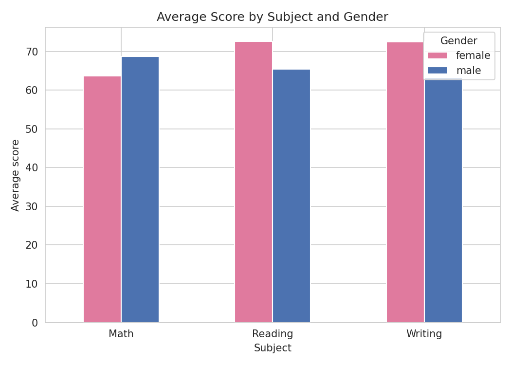
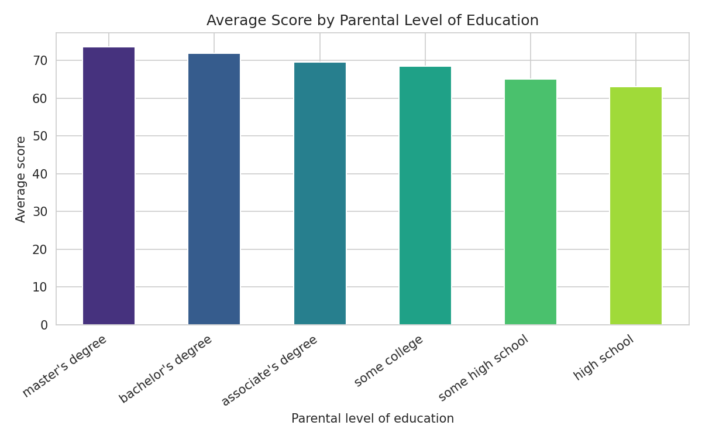
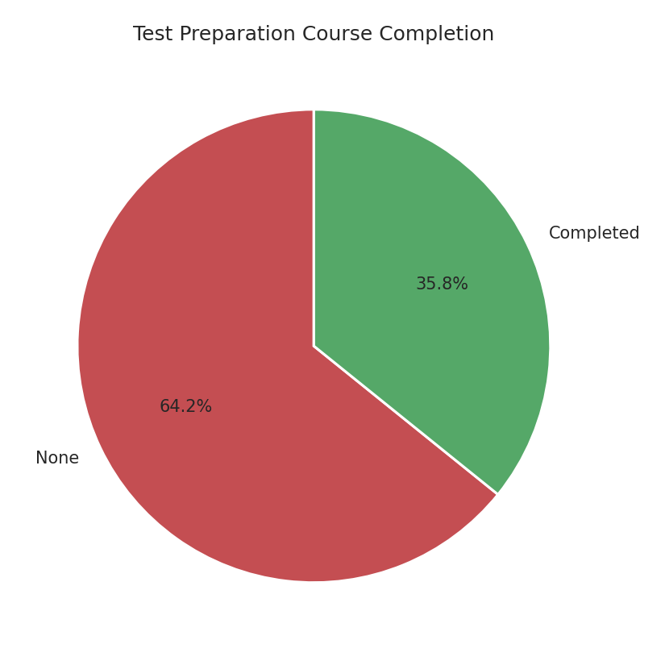
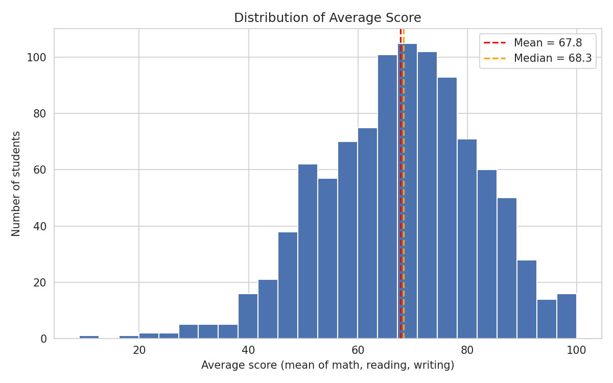
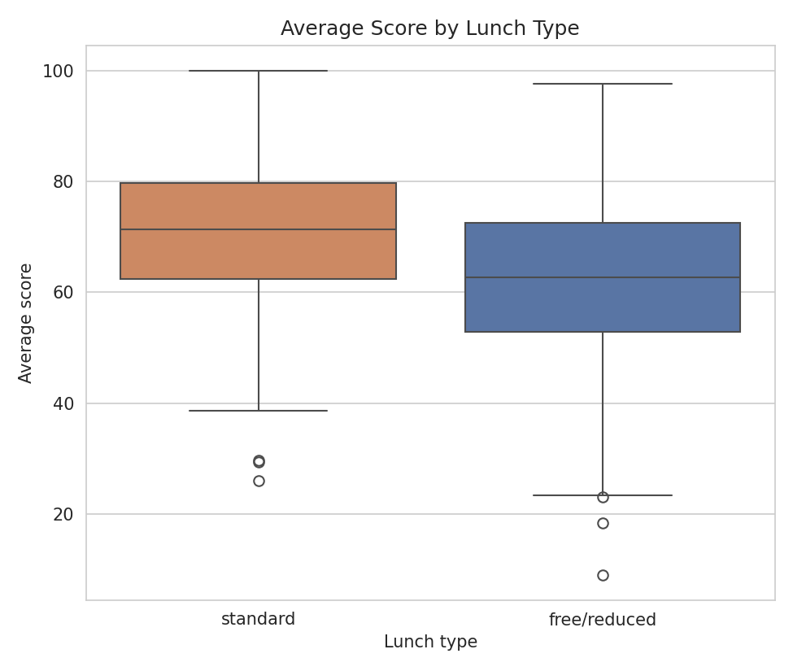
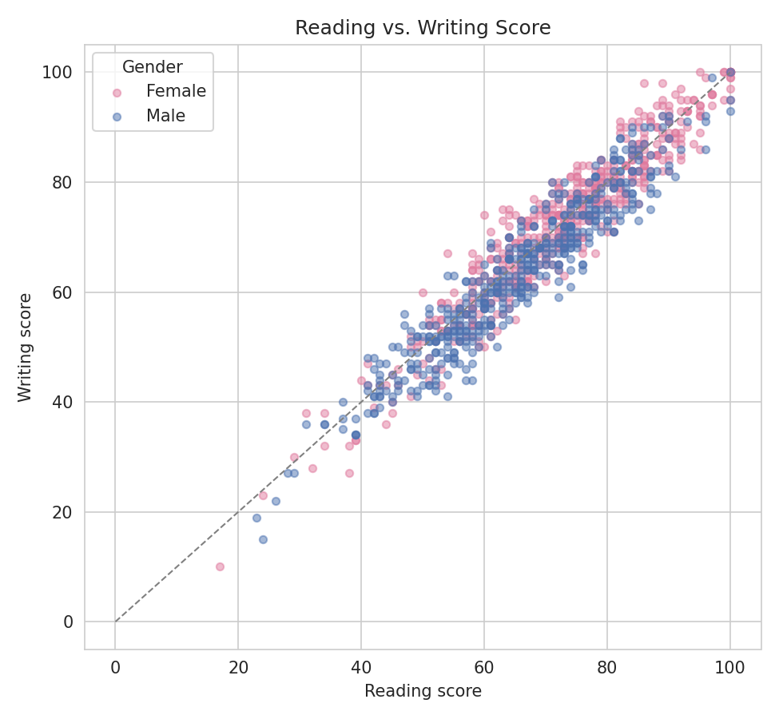
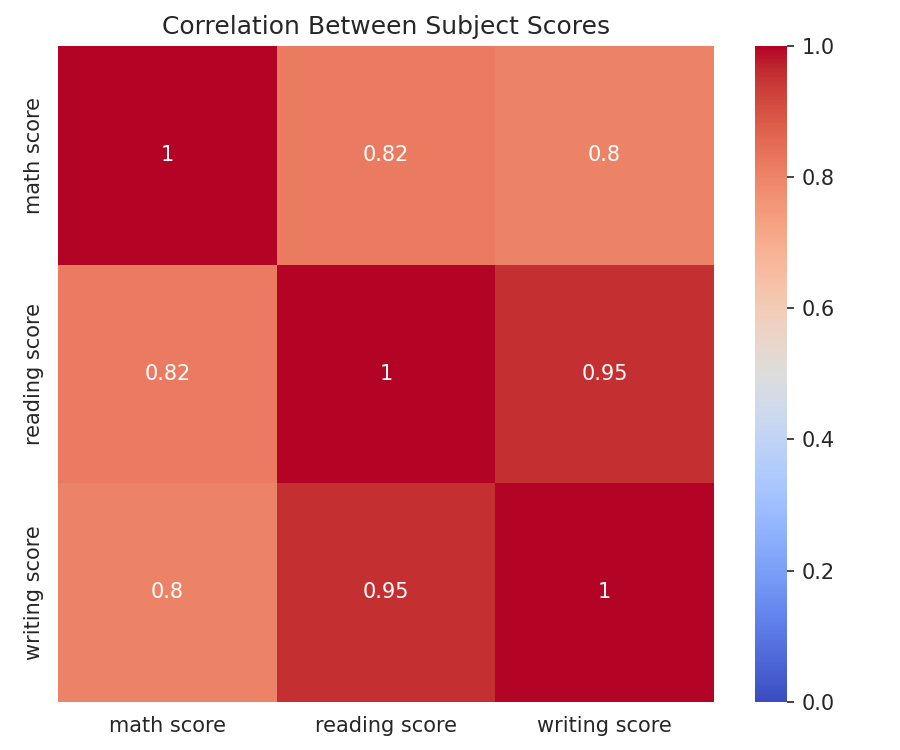

# 📊 Student Performance Analysis

**Beginner Project 01 — Data Cleaning, EDA & Visualization**

A complete, beginner-level walkthrough of the standard data analysis pipeline — load → clean → describe → compare → visualize → conclude — applied to a public dataset of 1,000 students' exam scores. The goal wasn't to produce as many charts as possible; it was to notice something real in the data and explain it clearly. Every chart and table here is followed by a plain-language interpretation of what it actually shows.

---

## 📁 Dataset

**Name:** Students Performance in Exams
**Source:** [Kaggle — spscientist/students-performance-in-exams](https://www.kaggle.com/datasets/spscientist/students-performance-in-exams) (originally shared by Royce Kimmons)
**Local copy:** [`data/StudentsPerformance.csv`](data/StudentsPerformance.csv)
**Size:** 1,000 rows × 8 columns

| Column | Type | Description |
|---|---|---|
| `gender` | categorical | female / male |
| `race/ethnicity` | categorical | anonymized group A–E |
| `parental level of education` | categorical | highest education level of the student's parent(s) |
| `lunch` | categorical | standard / free-reduced — a common socio-economic proxy in this dataset |
| `test preparation course` | categorical | none / completed |
| `math score` | numeric (0–100) | exam score |
| `reading score` | numeric (0–100) | exam score |
| `writing score` | numeric (0–100) | exam score |

---

## 🎯 Objective

This project builds the core foundation of any data role:

- Loading and inspecting raw data
- Discovering (and honestly reporting) what's wrong with it — or isn't
- Descriptive statistics and group comparisons
- Communicating findings through charts *with* interpretation, not charts alone
- Checking correlation between variables
- Summarizing findings in plain language

---

## 🛠️ Approach

1. **Load the data** — shape, columns, dtypes.
2. **Data quality check** — missing values, duplicate rows, out-of-range scores (should be 0–100), and inconsistent category labels.
3. **Descriptive statistics** — mean, median, mode, standard deviation, min, max for every numeric column.
4. **Group comparisons** — subject-wise, gender-wise, by test-prep completion, by lunch type, by parental education.
5. **Visualization** — bar chart, pie chart, histogram, box plot, and scatter plot, each with a written insight.
6. **Correlation check** — Pearson correlation between the three subject scores, shown as a table and a heatmap.
7. **Conclusion** — top 5 findings stated in plain language.

---

## 🔍 Data Quality — What Was Found

✅ **Zero missing values**
✅ **Zero duplicate rows**
✅ **Zero out-of-range scores** (all within 0–100)
✅ **Consistent category labels** — no typos, no stray casing/whitespace

The dataset needed no cleaning. This is reported as an explicit finding rather than skipped, since confirming a dataset is *actually* clean is part of a real quality check, not something to assume. The only preparation step taken was adding a derived `average score` column (mean of math, reading, writing) to simplify group comparisons.

---

## 📈 Key Findings

| # | Finding |
|---|---|
| 1 | **Lunch type (socio-economic proxy) shows the single largest score gap** — 8.6 points (standard: 70.8 vs. free/reduced: 62.2), holding across every subject. |
| 2 | **Parental education shows the widest gradient** — 10.5 points from "high school" parents (~63) to "master's degree" parents (~74). |
| 3 | **Test-prep completion is linked to a ~7.6-point gain** across all subjects — but only 36% of students completed it. |
| 4 | **Gender effects are subject-specific, not uniform** — males lead in math (+5.1), females lead more strongly in reading (+7.1) and writing (+9.2). |
| 5 | **Reading and writing scores are near-duplicates of each other** (r = 0.955); math is a more independent skill (r ≈ 0.80–0.82 with the others). |

Full reasoning, tables, and all group breakdowns are in the notebook and the summary report.

---

## 📊 Charts

All charts are in [`charts/`](charts/), each paired with its written interpretation in the notebook and PDF report.

> ⚠️ **Setup note:** the images below only render if the PNG files sit inside a folder named exactly `charts` at the root of this repo (case-sensitive), i.e. `charts/01_bar_subject_gender.png`, not the files loose in the repo root. Extract the `charts.zip` into a folder called `charts/` and commit that folder.

### Chart 1 — Average score by subject & gender


### Chart 2 — Average score by parental education


### Chart 3 — Test-prep course completion


### Chart 4 — Distribution of average score


### Chart 5 — Average score by lunch type


### Chart 6 — Reading vs. writing score


### Chart 7 — Correlation heatmap


---

## 📂 Repository Structure

```
student-performance-analysis/
├── data/
│   └── StudentsPerformance.csv              # dataset used
├── notebook/
│   └── student_performance_analysis.ipynb   # full analysis: code + outputs + markdown insights
├── charts/
│   ├── 01_bar_subject_gender.png
│   ├── 02_bar_parental_education.png
│   ├── 03_pie_test_prep.png
│   ├── 04_histogram_average_score.png
│   ├── 05_boxplot_lunch.png
│   ├── 06_scatter_reading_writing.png
│   └── 07_correlation_heatmap.png
├── summary_report.pdf                       # full written report of the project & findings
└── README.md
```

---

## 🧰 Tools & Libraries

- Python 3
- pandas, NumPy
- matplotlib, seaborn
- SciPy
- Jupyter Notebook

---

## ▶️ How to Run

```bash
git clone <this-repo-url>
cd student-performance-analysis
pip install pandas numpy matplotlib seaborn scipy jupyter
jupyter notebook notebook/student_performance_analysis.ipynb
```

---

## 👤 Author

**Muzammil A Muhammad**
BS Data Science, Sir Syed University of Engineering & Technology (SSUET), Karachi

---

## 📄 License

Dataset credit: Royce Kimmons, via Kaggle. This analysis is shared for educational/portfolio purposes.
